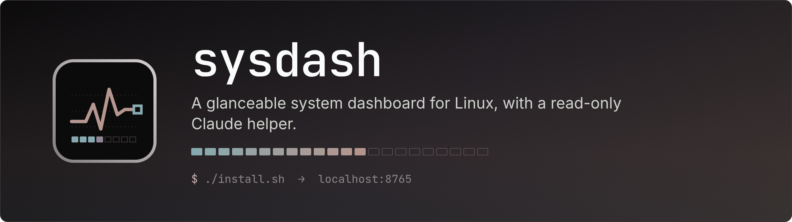
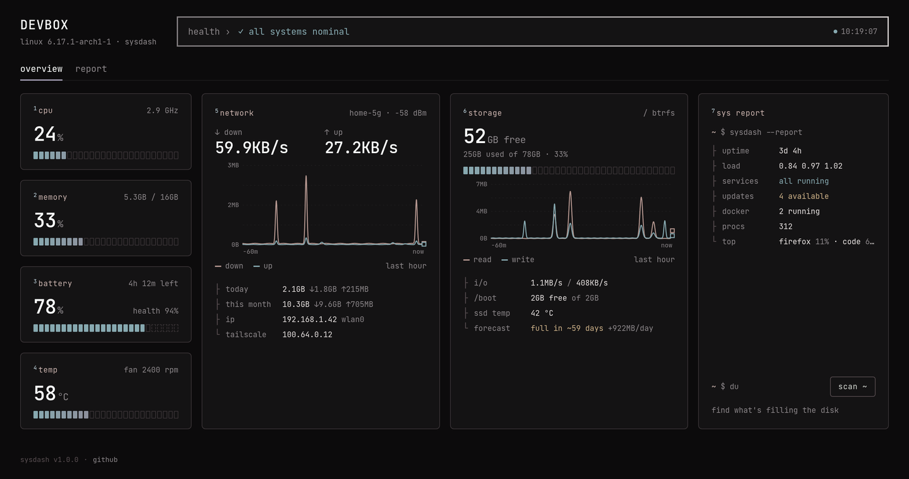
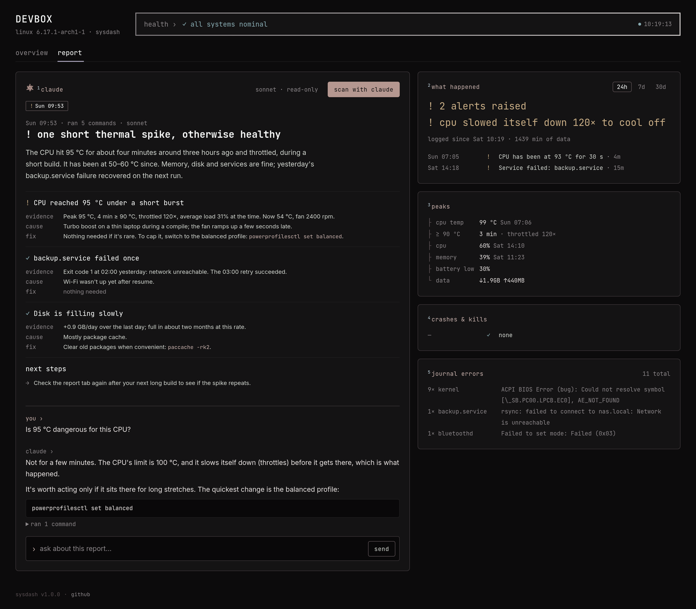
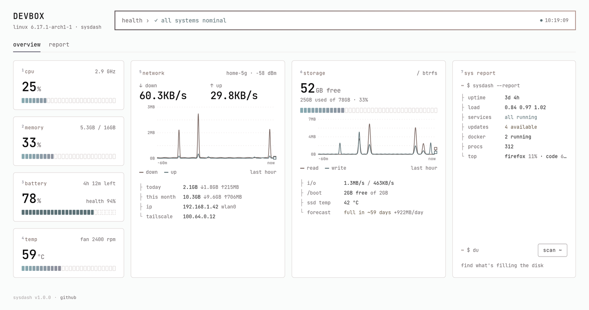
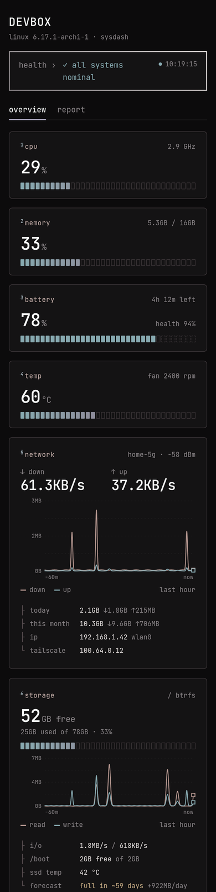
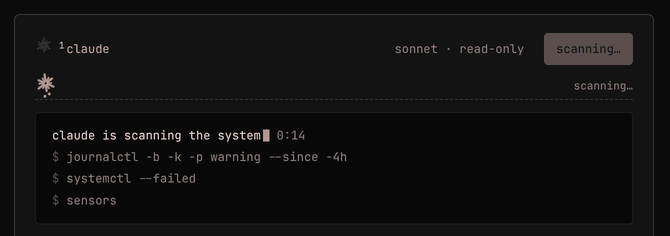

<p align="center">
  
</p>

<p align="center">
  <a href="https://github.com/syedmehedihussain/sysdash/releases"></a>
  <a href="LICENSE"></a>
  
  
  
  <a href="https://github.com/syedmehedihussain/sysdash/actions/workflows/ci.yml"></a>
</p>

<p align="center">
  <a href="#features">Features</a> ·
  <a href="#install">Install</a> ·
  <a href="#claude-scan--chat">Claude</a> ·
  <a href="#configuration">Configuration</a> ·
  <a href="#data--storage">Data</a> ·
  <a href="#contributing">Contributing</a>
</p>

---

**sysdash** shows the state of your Linux machine on one quiet screen at `http://localhost:8765`: CPU, memory, battery, temperature, network, storage and anything that needs attention. It keeps a short history, so when something goes wrong you can look back at what happened. Press a button and Claude checks the system read-only and explains it.

It's one Python file plus one HTML page. There's nothing to `pip install`, no Node, and no database server.

<p align="center">
  
</p>

## Features

| | |
|---|---|
| **Glanceable** | One number and one block meter per tile. A single **health** line says `✓ all systems nominal` or lists what's wrong. |
| **Live traces** | Network and disk activity for the last hour, with a crosshair and tooltip on hover. |
| **Data usage** | Data downloaded and uploaded today and this month, kept across reboots. VPN traffic (Tailscale or WireGuard) is counted separately. |
| **Storage forecast** | Free space plus a *"full in ~2 months"* estimate based on the last 30 days. |
| **Calm alerts** | Smoothed over 30 seconds with hysteresis, so short spikes don't trigger them. One desktop notification per problem, never repeated within 30 minutes. |
| **Incident log** | A per-minute history, an alert timeline, unexpected shutdowns, crashes, out-of-memory kills and the noisiest journal errors. Kept for 30 days. |
| **Ask Claude** *(optional)* | A read-only scan that writes a report, then a chat about it, using your own Claude Code login. |
| **Battery care** | Health %, charge cycles, time left, and your charge limit shown as dashed cells on the meter. |
| **Space hogs** | A one-click *"what's filling my disk"* scan of your home folder that you can drill into. |
| **Light & dark** | Dark by default, light mode follows your OS, readable on a phone. |
| **Local only** | Listens on `127.0.0.1` with a per-run token for every action. Your data never leaves the machine. |

<table>
  <tr>
    <td width="50%"></td>
    <td width="50%"></td>
  </tr>
  <tr>
    <td align="center"><sub><b>Report tab:</b> Claude's findings and chat, alert timeline, peaks</sub></td>
    <td align="center"><sub><b>Light mode</b> follows your system setting</sub></td>
  </tr>
</table>

<details>
<summary><b>On a phone</b></summary>
<p align="center"></p>
</details>

> [!NOTE]
> All screenshots come from `python3 demo.py`, which uses made-up data.

## Install

**Requirements:** Linux with systemd, and Python 3.10 or newer. That's all.

```bash
git clone https://github.com/syedmehedihussain/sysdash.git
cd sysdash
./install.sh
```

Then open **<http://localhost:8765>**.

`install.sh` sets up a systemd **user** service that starts when you log in. It doesn't need root and doesn't install anything system-wide.

<details>
<summary><b>Other ways to run it</b></summary>

```bash
python3 sysdash.py                 # run in the foreground, no service
SYSDASH_PORT=9000 ./install.sh     # use another port
python3 demo.py                    # made-up data on :8766, nothing about your machine shown
```

</details>

<details>
<summary><b>Optional extras</b></summary>

sysdash picks these up automatically when they're installed and hides what it can't use.

| Tool | Adds |
|---|---|
| [`claude`](https://claude.com/claude-code) (Claude Code CLI) | The *scan with claude* button and chat |
| `notify-send` (libnotify) | Desktop notifications for alerts |
| `iw` | The Wi-Fi network name |
| `docker` | The running container count |
| `checkupdates` (pacman-contrib, Arch) | The pending update count |

</details>

**Update:** `git pull && systemctl --user restart sysdash`

**Uninstall:** `./uninstall.sh` (your history stays; `./uninstall.sh --purge` deletes it too)

## Claude scan & chat

<p align="center">
  
</p>

If the [Claude Code](https://claude.com/claude-code) CLI is installed and logged in, the **report** tab gets a **scan with claude** button. Claude reads sysdash's history, inspects the system and writes a short report: a headline, findings with evidence, cause and fix, and next steps. You can then ask follow-up questions in the chat below the report.

- **It runs only when you click.** Nothing runs in the background or on a schedule.
- **It's read-only.** Claude gets an allowlist of inspection commands (`journalctl`, `systemctl status`, `coredumpctl info`, `sensors`, `df`, `ps`, …) and read access to `/proc`, `/sys`, `/etc` and `/var/log`. Everything else is refused without prompting, and fixes are given to you as commands to run yourself.
- **It uses your own subscription.** Scans and chat messages count toward your Claude plan's usage. The default model is Sonnet.
- **It can learn your machine.** Write known-harmless log messages or quirks to `~/.local/state/sysdash/notes.md`, and Claude will take them into account.

## Command line

```bash
python3 sysdash.py report 24       # plain-text incident report for the last 24 hours
python3 sysdash.py open            # open the dashboard window
python3 sysdash.py --version
```

The text report is handy to paste into an issue, or to give an AI assistant when you ask *"what went wrong with my system?"*.

## Configuration

Everything is set with environment variables. For the service, add them to `~/.config/systemd/user/sysdash.service` under `[Service]`.

| Variable | Default | |
|---|---|---|
| `SYSDASH_PORT` | `8765` | Port to listen on (always `127.0.0.1`) |
| `SYSDASH_DATA` | `~/.local/state/sysdash` | Where history, data totals and Claude reports are stored |
| `SYSDASH_MODEL` | `sonnet` | Claude model for scans and chat |

## Data & storage

Everything stays in **`~/.local/state/sysdash/`** (or `$SYSDASH_DATA`):

| File | Holds | Kept for |
|---|---|---|
| `history.db` | One SQLite row per minute (CPU, temperature, memory, disk, network, battery), plus alert events | 30 days of samples, 180 days of alerts |
| `netusage.json` | Bytes per interface per day | ~13 months |
| `reports/*.json` | Claude reports and their chats | Until you delete them |
| `notes.md` | Your optional notes for Claude | Until you delete it |

It all takes a few megabytes. To back it up, copy the folder.

## Security & privacy

- **Local only.** It binds to `127.0.0.1`, so nothing on your network can reach it.
- **No DNS rebinding.** Requests addressed to any host other than localhost are refused.
- **No cross-site tricks.** Every action (`POST`) needs a per-run token that only the dashboard page has, so other websites can't start a scan or a chat.
- **No telemetry.** sysdash never sends data anywhere. The only network traffic is loading the fonts and any Claude session you start yourself.

Found a vulnerability? Please see [SECURITY.md](SECURITY.md).

## Omarchy extras

On [Omarchy](https://omarchy.org) you can add a status dot to the bar (dim when fine, sand or clay when something's wrong), an app-launcher entry and a keybinding. See [`contrib/omarchy`](contrib/omarchy/README.md).

## Contributing

Bug reports, ideas and pull requests are welcome. Read **[CONTRIBUTING.md](CONTRIBUTING.md)** first. It's short. Good first contributions:

- Sensor support for more hardware (CPU and GPU temperatures, fans)
- Packaging (AUR, Nix, deb)
- Translations of the interface text

## Changelog

See **[CHANGELOG.md](CHANGELOG.md)**. The current release is **1.0.0**.

## Acknowledgements

- The palette is derived from the [Omarchy](https://omarchy.org) theme **Last Horizon**.
- Type is [JetBrains Mono](https://www.jetbrains.com/lp/mono/) and [Inter](https://rsms.me/inter/).
- Claude features run through the [Claude Code](https://claude.com/claude-code) CLI. sysdash is an independent project, not affiliated with Anthropic.

## License

[MIT](LICENSE) © 2026 Syed Mehedi Hussain
